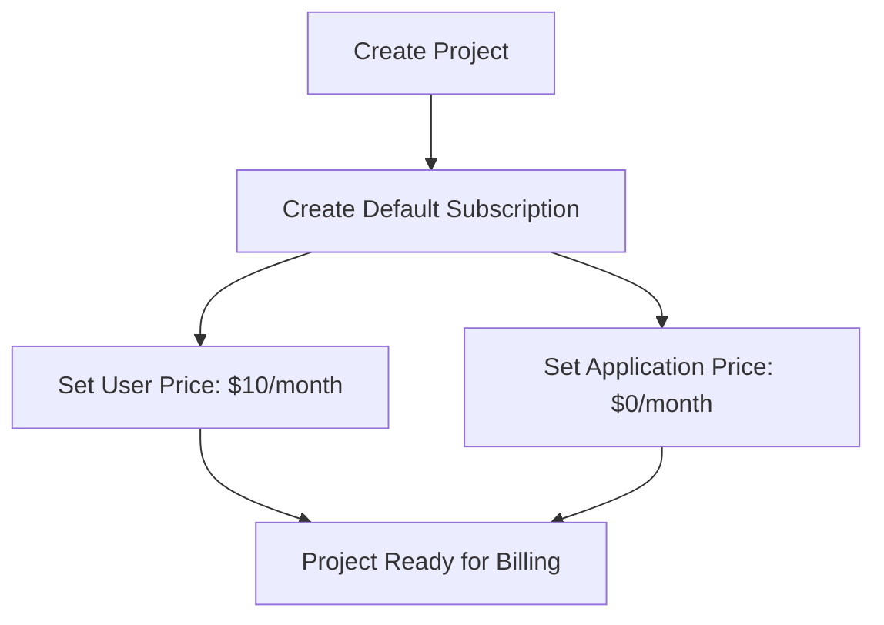
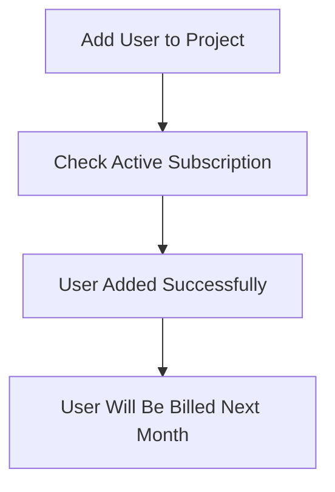
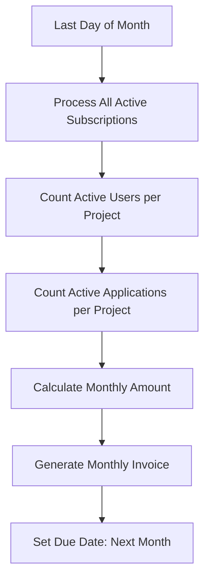
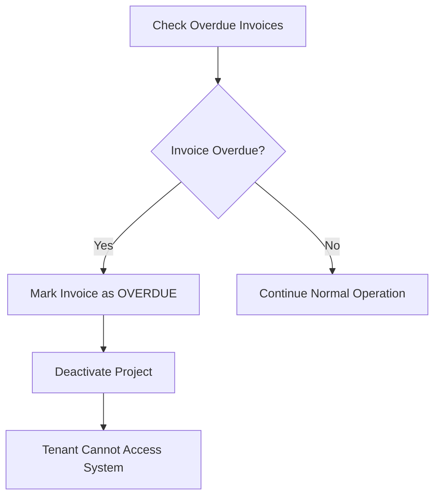

# Nexus ERP Billing Philosophy

## Overview

The Nexus ERP system implements a **core-based billing model** where billing is managed at the platform level, not within individual tenant databases. This approach provides centralized billing control, automatic tenant management, and simplified pricing structures.

## Core Principles

### 1. **Centralized Billing Management**
- All billing data is stored in the main database
- Single source of truth for subscriptions, invoices, and payments
- Platform-level control over tenant billing status

### 2. **User-Based Pricing**
- **Primary Model**: Pay per active user per month
- **Default Price**: $10.00 per user per month
- **Monthly Billing**: Users pay full monthly price regardless of when added

### 3. **Application Catalog Pricing**
- **Global Application Catalog**: Applications are managed globally, not per-tenant
- **Tenant Selection**: Tenants select which applications they want to use
- **Custom Pricing**: Each tenant can have custom pricing for applications
- **Flexible Billing**: Different tenants can have different application combinations

### 4. **Automatic Tenant Management**
- **Monthly Billing**: Automatic billing on the last day of each month
- **Overdue Handling**: Automatic tenant deactivation for non-payment
- **Grace Period**: None - immediate deactivation for overdue invoices

## Billing Architecture

### Database Structure

#### Main Database (Billing Tables)
```sql
-- Subscriptions (one per tenant)
subscriptions (
  id, projectId, userId,
  userPricePerMonth, applicationPricePerMonth,
  isActive, lastBilled, nextBilling
)

-- Invoices (generated monthly + prorated)
invoices (
  id, subscriptionId, projectId,
  invoiceNumber, amount, userCount, applicationCount,
  userAmount, applicationAmount,
  periodStart, periodEnd, status, dueDate, paidAt
)

-- Applications (global catalog)
applications (
  id, name, slug, description, icon,
  pricePerMonth, listed, isActive
)

-- Tenant Applications (tenant selections)
tenant_applications (
  id, projectId, applicationId,
  customPrice, isActive, addedAt
)
```

#### Tenant Database (User Management)
```sql
-- Users (billing is based on active user count)
users (
  id, email, firstName, lastName,
  isActive, createdAt, updatedAt
)
```

### Billing Flow

#### 1. **Project Creation**


#### 2. **User Addition**


#### 3. **Monthly Billing**


#### 4. **Overdue Handling**


## Pricing Models

### 1. **User-Based Pricing**

#### Standard User Pricing
- **Base Price**: $10.00 per user per month
- **Billing Cycle**: Monthly (last day of month)
- **User Count**: Based on active users in tenant database

#### Monthly Billing for All Users
- **Trigger**: Monthly billing on last day of month
- **Calculation**: All users pay full monthly price regardless of when added
- **Example**: User added on 15th → Pays full $10.00 next month

### 2. **Application Catalog Pricing**

#### Global Application Catalog
- **Global Applications**: Applications are managed centrally
- **Tenant Selection**: Tenants choose which applications to use
- **Custom Pricing**: Each tenant can override application prices
- **Flexible Billing**: Different tenants can have different application combinations

#### Application Catalog Examples
```javascript
// Global application catalog
{
  id: "app_123",
  name: "Basic CRM",
  slug: "basic-crm",
  description: "Customer relationship management",
  icon: "crm-icon.png",
  pricePerMonth: 0.00,
  listed: true
}

// Tenant application selection
{
  id: "tenant_app_123",
  projectId: "proj_123",
  applicationId: "app_123",
  customPrice: 5.00, // Override global price
  isActive: true
}
```

## Billing Automation

### 1. **Monthly Billing Process**

#### Automated Schedule
- **Frequency**: Last day of each month at 23:59
- **Process**: 
  1. Get all active subscriptions
  2. Count users and applications per project
  3. Calculate monthly amounts
  4. Generate invoices
  5. Set due dates for next month

#### Manual Trigger
```bash
# Trigger monthly billing manually
curl -X POST http://localhost:3000/billing/automation/monthly \
  -H "Authorization: Bearer <access_token>"
```

### 2. **Overdue Invoice Handling**

#### Automatic Checks
- **Frequency**: Every hour
- **Process**:
  1. Find invoices with `status: PENDING` and `dueDate < now`
  2. Mark as `status: OVERDUE`
  3. Deactivate project (`isActive: false`)
  4. Log deactivation event

#### Manual Check
```bash
# Check overdue invoices manually
curl -X POST http://localhost:3000/billing/automation/overdue \
  -H "Authorization: Bearer <access_token>"
```

## API Endpoints

### Core Billing Endpoints

#### Create Subscription
```http
POST /billing/subscriptions
{
  "projectId": "proj_123",
  "userPricePerMonth": 10.00,
  "applicationPricePerMonth": 0.00
}
```

#### Get Billing Status
```http
GET /billing/subscriptions/{projectId}
```

#### Process Payment
```http
POST /billing/payments/process
{
  "invoiceId": "inv_123",
  "paymentMethod": "stripe"
}
```

#### Get Invoices
```http
GET /billing/invoices/{projectId}?page=1&limit=10&status=PAID
```

### Application Management

#### Get Available Applications
```http
GET /billing/applications
```

#### Add Application to Tenant
```http
POST /billing/tenants/{projectId}/applications
{
  "applicationId": "app_123",
  "customPrice": 25.00
}
```

### Automation Endpoints

#### Trigger Monthly Billing
```http
POST /billing/automation/monthly
```

#### Get Billing Statistics
```http
GET /billing/statistics
```

## Billing Events

### Event Types
```typescript
enum BillingEvents {
  SUBSCRIPTION_CREATED = 'subscription.created',
  BILLING_INVOICE_GENERATED = 'billing.invoice.generated',
  BILLING_PRORATED_INVOICE_GENERATED = 'billing.prorated.invoice.generated',
  BILLING_APPLICATION_INVOICE_GENERATED = 'billing.application.invoice.generated',
  BILLING_PROJECT_DEACTIVATED = 'billing.project.deactivated',
  PAYMENT_PROCESSED = 'payment.processed'
}
```

### Event Examples
```javascript
// Monthly invoice generated
{
  event: 'billing.invoice.generated',
  data: {
    subscriptionId: 'sub_123',
    projectId: 'proj_123',
    invoiceId: 'inv_123',
    amount: '150.00',
    dueDate: '2024-02-29T23:59:59Z'
  }
}

// Project deactivated due to overdue payment
{
  event: 'billing.project.deactivated',
  data: {
    projectId: 'proj_123',
    invoiceId: 'inv_123',
    overdueDays: 5,
    deactivatedAt: '2024-01-15T10:30:00Z'
  }
}
```

## Implementation Details

### 1. **Database Migrations**

#### Add Billing Tables to Main Database
```sql
-- Add domain field to projects
ALTER TABLE projects ADD COLUMN domain TEXT UNIQUE;

-- Create billing tables
CREATE TABLE subscriptions (
  id TEXT PRIMARY KEY,
  projectId TEXT NOT NULL,
  userId TEXT NOT NULL,
  userPricePerMonth DECIMAL(10,2) DEFAULT 10.00,
  applicationPricePerMonth DECIMAL(10,2) DEFAULT 0.00,
  isActive BOOLEAN DEFAULT true,
  lastBilled TIMESTAMP,
  nextBilling TIMESTAMP NOT NULL,
  createdAt TIMESTAMP DEFAULT NOW(),
  updatedAt TIMESTAMP DEFAULT NOW()
);

CREATE TABLE invoices (
  id TEXT PRIMARY KEY,
  subscriptionId TEXT NOT NULL,
  projectId TEXT NOT NULL,
  invoiceNumber TEXT UNIQUE NOT NULL,
  amount DECIMAL(10,2) NOT NULL,
  userCount INTEGER NOT NULL,
  applicationCount INTEGER NOT NULL,
  userAmount DECIMAL(10,2) NOT NULL,
  applicationAmount DECIMAL(10,2) NOT NULL,
  periodStart TIMESTAMP NOT NULL,
  periodEnd TIMESTAMP NOT NULL,
  status TEXT DEFAULT 'PENDING',
  paidAt TIMESTAMP,
  dueDate TIMESTAMP NOT NULL,
  createdAt TIMESTAMP DEFAULT NOW(),
  updatedAt TIMESTAMP DEFAULT NOW()
);

CREATE TABLE applications (
  id TEXT PRIMARY KEY,
  name TEXT UNIQUE NOT NULL,
  slug TEXT UNIQUE NOT NULL,
  description TEXT,
  icon TEXT,
  pricePerMonth DECIMAL(10,2) DEFAULT 0.00,
  listed BOOLEAN DEFAULT true,
  isActive BOOLEAN DEFAULT true,
  createdAt TIMESTAMP DEFAULT NOW(),
  updatedAt TIMESTAMP DEFAULT NOW()
);

CREATE TABLE tenant_applications (
  id TEXT PRIMARY KEY,
  projectId TEXT NOT NULL,
  applicationId TEXT NOT NULL,
  customPrice DECIMAL(10,2),
  isActive BOOLEAN DEFAULT true,
  addedAt TIMESTAMP DEFAULT NOW(),
  UNIQUE(projectId, applicationId)
);
```

### 2. **Service Architecture**

#### Core Billing Service
- **Purpose**: Handle billing calculations and invoice generation
- **Location**: `src/core/billing/coreBillingService.ts`
- **Key Methods**:
  - `createSubscription()`
  - `calculateBilling()`
  - `generateMonthlyInvoice()`
  - `processPayment()`

#### Billing Automation Service
- **Purpose**: Handle automated billing processes
- **Location**: `src/core/billing/billingAutomationService.ts`
- **Key Methods**:
  - `processMonthlyBilling()`
  - `processNewUserBilling()`
  - `processApplicationBilling()`

#### User Billing Service
- **Purpose**: Handle user-specific billing logic
- **Location**: `src/core/billing/userBillingService.ts`
- **Key Methods**:
  - `handleUserAdded()`
  - `handleUserRemoved()`
  - `getBillingSummary()`

#### Billing Cron Service
- **Purpose**: Schedule and manage automated billing
- **Location**: `src/core/billing/billingCronService.ts`
- **Key Methods**:
  - `start()`
  - `runMonthlyBilling()`
  - `checkOverdueInvoices()`

### 3. **Integration Points**

#### Project Creation
```typescript
// When a project is created, automatically create a subscription
const project = await mainClient.project.create({...});
const subscription = await coreBillingService.createSubscription(
  project.id,
  req.user!.id,
  10.00, // Default user price
  0.00   // Default application price
);
```

#### User Addition
```typescript
// When a user is added to a project, no immediate billing
await mainClient.userProject.create({...});
await userBillingService.handleUserAdded(projectId, userId);
// User will be billed in next monthly cycle
```

#### Monthly Billing
```typescript
// Automated monthly billing process
const result = await billingAutomationService.processMonthlyBilling();
// Generates invoices for all active subscriptions
```

## Benefits of This Approach

### 1. **Simplified Management**
- Single billing system for all tenants
- Centralized invoice generation and payment processing
- Automated tenant lifecycle management

### 2. **Predictable Pricing**
- Clear per-user pricing model
- Transparent application catalog pricing
- Monthly billing for consistency

### 3. **Automatic Enforcement**
- No manual intervention required
- Automatic tenant deactivation for non-payment
- Consistent billing cycles

### 4. **Scalable Architecture**
- Handles unlimited tenants
- Efficient database queries
- Event-driven notifications

### 5. **Developer Friendly**
- Simple API endpoints
- Clear billing events
- Comprehensive logging

## Migration from Old System

### 1. **Data Migration**
```sql
-- Migrate existing billing data to new structure
-- (Implementation depends on current system)
```

### 2. **API Updates**
- Update all billing-related API calls
- Implement new subscription management
- Add application pricing support

### 3. **Testing**
- Test monthly billing automation
- Verify prorated billing calculations
- Test overdue invoice handling

## Monitoring and Analytics

### 1. **Billing Statistics**
```http
GET /billing/statistics
{
  "subscriptions": {
    "total": 150,
    "active": 145,
    "inactive": 5
  },
  "invoices": {
    "total": 1200,
    "paid": 1150,
    "overdue": 25,
    "pending": 25
  },
  "revenue": {
    "total": "125000.00",
    "monthly": "15000.00"
  }
}
```

### 2. **Health Monitoring**
- Monitor billing automation status
- Track overdue invoice counts
- Alert on billing failures

### 3. **Performance Metrics**
- Invoice generation time
- Payment processing success rate
- Tenant activation/deactivation rates

## Conclusion

The new billing philosophy provides a robust, automated, and scalable billing system that:

- **Centralizes billing management** at the platform level
- **Automates tenant lifecycle** with minimal manual intervention
- **Provides consistent pricing** with monthly billing for all users
- **Ensures predictable revenue** through automated monthly billing
- **Maintains system integrity** through automatic tenant deactivation
- **Offers flexible application selection** with global catalog and custom pricing

This approach transforms Nexus ERP into a truly enterprise-ready SaaS platform with professional billing capabilities that can scale to thousands of tenants while maintaining operational efficiency.
